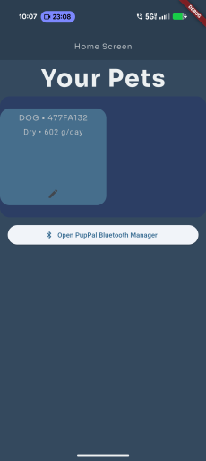
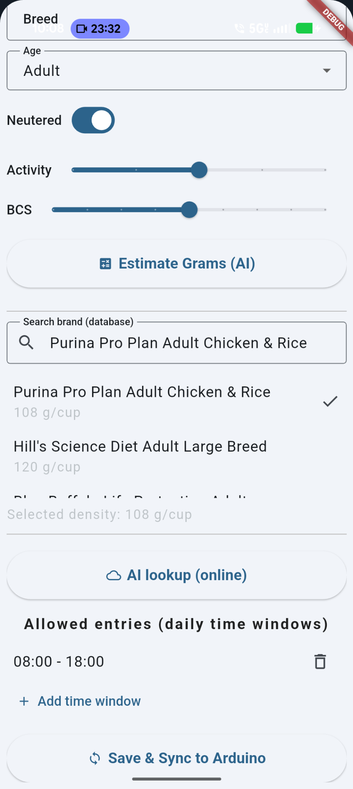
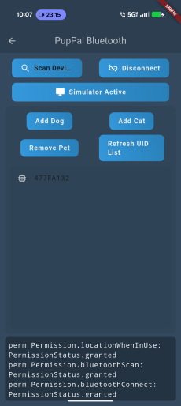
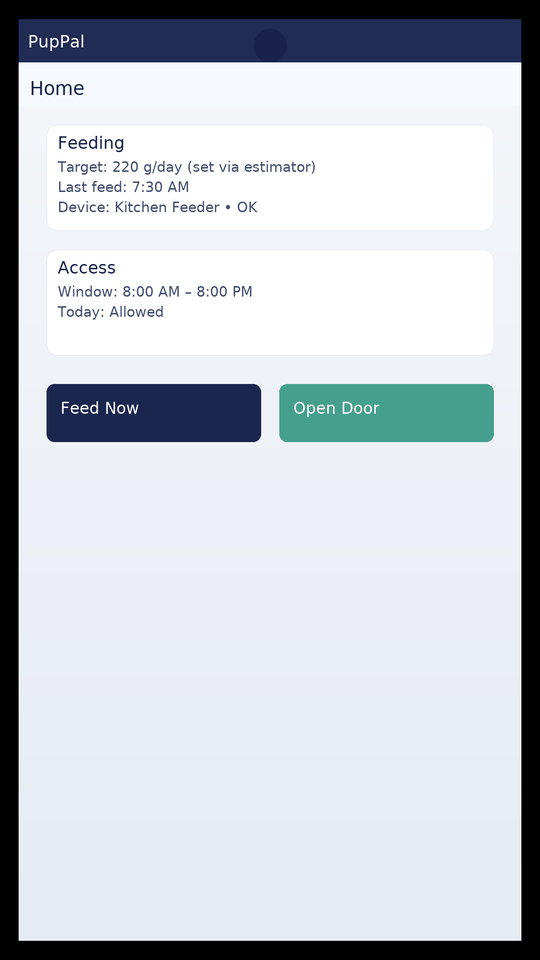

<p align="center">
  
</p>

<h1 align="center">PupPal 🐾</h1>
<p align="center">
  A Flutter app for pet care—feeding guidance, device control, and optional local AI helpers.
</p>

<p align="center">
  <a href="https://github.com/yonathan-star/puppal_app/stargazers">
    
  </a>
  
  
  
  <a href="LICENSE"></a>
</p>

---

## ✨ Features
- **Feeding Estimator (Local)**: weight + breed → grams/day using standard RER/MER formulas (offline).
- **Extensible**: optional Cloudflare Worker for server tasks; room for BLE/Serial device control.
- **Flutter scaffold**: runs on Android (Pixel), iOS, and Web.

> **Note**: The estimator is guidance only—always confirm with a veterinarian.

---

## 🗂️ Repository Layout

puppal_app/
├─ lib/ # Flutter application code
├─ assets/readme/ # Images used in this README (screenshots, banner)
├─ cloudflare_worker/ # Optional edge/backend worker (TypeScript)
├─ android/ ios/ web/ … # Platform targets
└─ README.md


---

<h2 align="center">📸 Screenshots</h2>

<p align="center">
  <a href="assets/readme/home.png"></a>
  <a href="assets/readme/calculator.png"></a>
  <a href="assets/readme/bluetooth.png"></a>
</p>

<p align="center">
  <a href="assets/readme/calculator-2.png"></a>
</p>
<p align="center">
  
</p>

---

## 🚀 Getting Started

### Prereqs
- Flutter SDK (stable), Dart
- For Android (Pixel): Android SDK + USB debugging enabled

### Install & run
```bash
git clone https://github.com/yonathan-star/puppal_app.git
cd puppal_app
flutter pub get
flutter run

### If you have a Pixel plugged in:
flutter devices
flutter run -d <pixel_device_id>

### 🧠 Local Feeding Estimator (optional module)
### This repo supports a local, offline feeding estimator based on veterinary formulas:
RER = 70 × (kg^0.75)
MER = RER × factor (species, age, neuter, activity, breed bias, BCS)
Grams/day = MER_kcal / kcal_per_gram
Suggested integration (example files):
Logic: lib/ai/local_feeding_ai.dart
UI page: lib/pages/feeding_calculator_page.dart
Open from any screen:

import 'package:puppal_app/pages/feeding_calculator_page.dart';
final grams = await showFeedingCalculator(context);

### ☁️ Optional: Cloudflare Worker

### If you want a lightweight backend:

cd cloudflare_worker
npm i
npx wrangler login
npx wrangler deploy

### 🧪 Testing

flutter test

### 📦 Build

### Android:

flutter build apk --release
# or
flutter build appbundle --release


### iOS (on macOS):

flutter build ios --release


### Web:

flutter build web

🤝 Contributing
Create a feature branch: git checkout -b feature/<name>
Commit with clear messages
Open a PR with summary, screenshots/GIF if UI, and test notes


